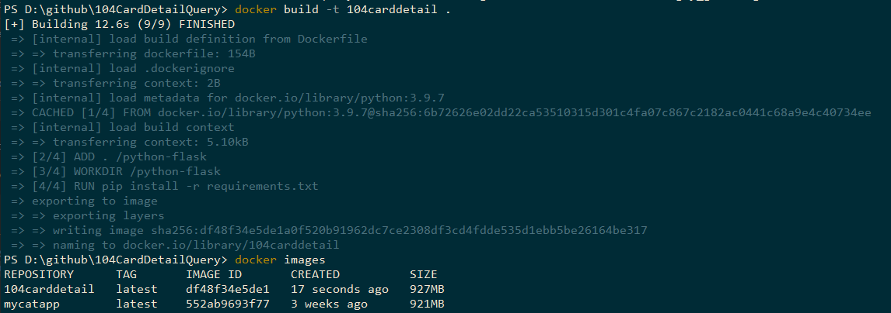

# Dockerize Flask app
1. Prepare Dockerfile

```dockerfile
    FROM python:3.9.7
    ADD . /python-flask
    WORKDIR /python-flask    
    RUN pip install -r requirements.txt
    CMD python app.py
```
2. Build docker image

```powershell
    docker build -t 104carddetail .
```

3. Run docker container

```powershell
    docker run -d --name=104queryapp --rm -p 5000:5000 104carddetail
```


